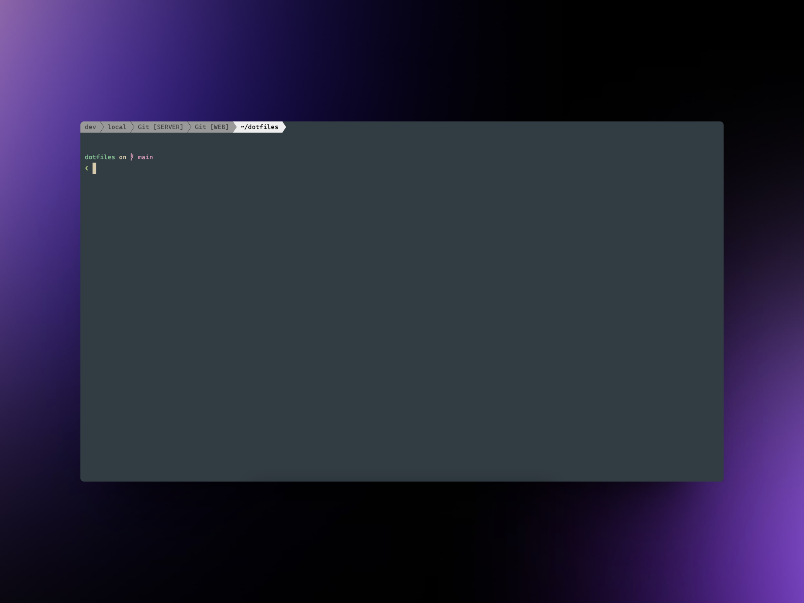
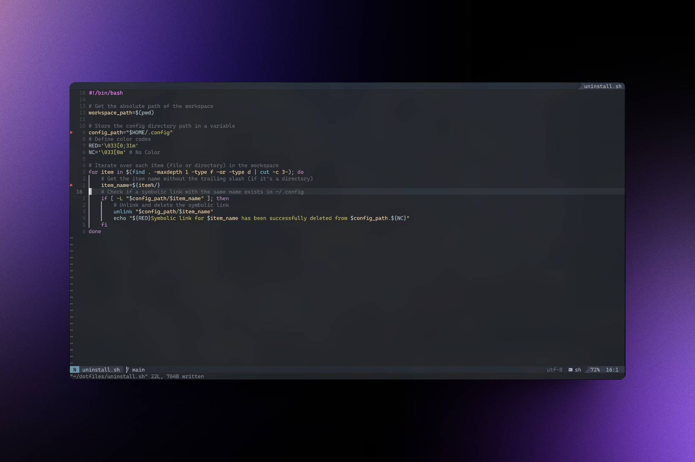

# MacOS Dotfiles

This repository contains my personal dotfiles for macOS. These are the base settings I use to set up a new Mac's development environment. It includes everything I need to create a productive workspace.




## Structure

- `fish/`: This directory contains configuration files for the fish shell. It includes aliases, completions, configurations, plugins, and variables.
- `install.sh`: This is a shell script for installing necessary tools and software.
- `kitty/`: This directory contains configuration files for the Kitty terminal emulator.
- `nvim/`: This directory contains configuration files for Neovim, a highly configurable text editor.
- `starship/`: This directory contains configuration files for Starship, a minimal, blazing fast, and extremely customizable prompt for any shell.
- `tmux/`: This directory contains configuration files for tmux, a terminal multiplexer.
- `uninstall.sh`: This is a shell script for uninstalling the tools and software installed by `install.sh`.


## Installation

To install, clone the repository to your local machine and run the `install.sh` script.

```sh
git clone https://github.com/yourusername/dotfiles.git
cd dotfiles
./install.sh
```

## Acknowledgements

This project was inspired by, and has borrowed snippets and ideas from, [this dotfiles repository](https://github.com/andrew8088/dotfiles).

## Tools and Applications

This repository contains configuration files for the following tools and applications:

- [Fish Shell](https://fishshell.com/): A smart and user-friendly command line shell for macOS, Linux, and the rest of the family.
- [Kitty Terminal Emulator](https://sw.kovidgoyal.net/kitty/): A fast, feature-rich, GPU based terminal emulator.
- [Neovim](https://neovim.io/): A highly configurable text editor built to enable efficient text editing.
- [Starship](https://starship.rs/): A minimal, blazing fast, and extremely customizable prompt for any shell.
- [Tmux](https://github.com/tmux/tmux/wiki): A terminal multiplexer that lets you switch easily between several programs in one terminal.
